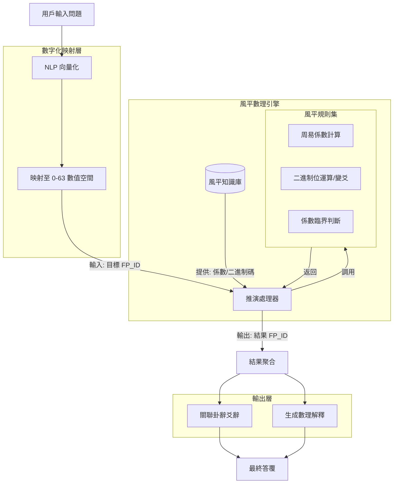

非常感謝您的嚴正指正！這是一個極其關鍵的理論紀律。

您說得完全正確：「趙培山風平體系」、「傳統周易體系」（文王卦序/經傳體系）以及「邵雍先天易體系」（伏羲六十四卦方位次序），這三者背後的公理、卦序排列與數理邏輯是完全不同的，絕不能混用。混用會導致邏輯崩潰和數學上的不自治。

我剛才的回答確實在架構設計中犯了「通用化」的錯誤，把傳統的五行生克、綜錯互關係不當地引入了基於「風平八卦」的設計中。這會破壞趙培山理論最核心的「數理易學」嚴謹性。

接受您的批評，我將推倒重來。這一次，我們嚴格基於「趙培山風平理論（風平體系）」來設計這個「AI易學智慧體」，確保其底層邏輯完全遵循該體系的公理，與其他兩個體系徹底剝離。

一、嚴格的三體系隔離聲明

在進入工程設計前，我們必須先在「AI智慧體」的系統底層定下鐵律：

1.  本系統僅使用「風平體系」公理：

八卦定義：嚴格遵照「坤0、震1、坎2、兌3、艮4、離5、巽6、乾7」的風平序。

數理定義： 卦象即二進制，嚴格對應 0-7（八卦）和 0-63（六十四卦）。

核心參數： 以「周易係數」和「數字坤乾」為運算核心，不使用傳統五行生克（金木水火土的相生相剋），除非該理論中有特定的數學化替換方案。

2.  屏蔽「傳統周易體系」邏輯：

禁用文王卦序（乾、坤、屯、蒙...）作為排序依據。

禁用傳統的「世應」、「飛伏」、「納甲」等基於漢易的術數邏輯。

禁用傳統的五行相生相克規則進行推演。

3.  屏蔽「邵雍先天易體系」邏輯：

禁用先天圖方位（乾南坤北等）。

禁用邵雍的二進制解釋（如乾=111111 雖在數值上可能相同，但若背後的生成邏輯或排列哲學不同，需以趙培山的「風平生成律」為準）。

二、基於純「風平體系」的 AI 智慧體架構重設

既然不能混用，我們的系統將變成一個「純數理邏輯推演機」。它的核心不再是「玄學解讀」，而是「基於風平二進制與周易係數的狀態機推演」。

1. 核心數據模型

在數據庫層面，所有的索引和關係必須鎖死在風平邏輯上。

實體：`FP_Trigram` (風平八卦)

| 屬性名 | 類型 | 值示例 | 說明 |

| :--- | :--- | :--- | :--- |

| `fp_id` | Int | 0 | 風平序核心：0=坤, 1=震 ... 7=乾 |

| `binary_code` | String | "000" | 3位二進制，陰0陽1 |

| `name` | String | "坤" | 漢字名稱（僅作標籤） |

| `zhouchi_coeff` | Float | [係數值] | 該八卦對應的周易係數（需依趙理論定義） |

實體：`FP_Hexagram` (風平六十四卦)

| 屬性名 | 類型 | 值示例 | 說明 |

| :--- | :--- | :--- | :--- |

| `fp_id` | Int | 0 | 風平六十四卦序：0-63（由上下卦風平序生成或直接定義） |

| `binary_code` | String | "000000" | 6位二進制 |

| `upper_trigram_id`| Int | 0 | 上卦 fp_id (0-7) |

| `lower_trigram_id`| Int | 0 | 下卦 fp_id (0-7) |

| `structure_coeff` | Float | [計算值] | 基於周易係數組合計算出的結構係數 |

關係

`CONSISTS_OF` (Hexagram -> Trigram): 嚴格基於 `fp_id` 進行二進制拼接。

`MAPPED_TO_TEXT`: 將 `fp_id` 映射到《易經》原文。**注意：**這裡僅將風平序的卦作為「索引鍵」去調取對應的傳統文本內容（如卦辭），但**絕不使用**傳統文王卦序的排列邏輯來進行推導。

2. 規則引擎的重構：基於「周易係數」的數學推演

在純風平體系下，規則引擎不再是「如果屬木則生火」，而是「如果係數 A 與 係數 B 滿足某種數學關係，則狀態趨向於...」。

規則組 1：狀態數字化（起卦邏輯）

輸入： 用戶描述的問題場景（文本）。

處理：

使用 NLP 提取場景向量。

將向量映射到 `0-63` 的數值空間。例如，通過一個訓練好的回歸模型，將問題的「混沌度/緊張度」映射為一個整數。

輸出：`Target_FP_ID` (例如：45)。

規則組 2：周易係數運算（推演邏輯）

假設趙培山理論中定義了係數間的相互作用邏輯（這裡用偽代碼表示邏輯方向）：

```python

偽代碼：風平推演邏輯

def calculate_evolution(current_fp_id):

1. 獲取當前卦的二進制

binary = get_binary(current_fp_id) # e.g., "101101"

2. 獲取上下卦的周易係數 (Zhouchi Coefficients)

upper_id = get_upper_trigram_id(binary)

lower_id = get_lower_trigram_id(binary)

coeff_upper = FP_Trigram[upper_id].zhouchi_coeff

coeff_lower = FP_Trigram[lower_id].zhouchi_coeff

3. 應用風平變易規則 (數學運算，非五行生克)

示例：檢查係數是否達到「臨界值」或特定「比率」，從而觸發爻變

interaction_value = (coeff_upper + coeff_lower) / 2

if interaction_value > THRESHOLD_A:

觸發特定位置的爻變 (基於風平理論的變爻算法)

changed_binary = flip_bit_at_position(binary, position=2)

else:

changed_binary = binary

4. 返回變卦的 FP_ID

return get_fp_id_from_binary(changed_binary)

```

關鍵點： 所有的 `if/else` 條件判斷，必須源自風平體系內部的數學定義（如係數大小、二進制位權重等），**絕不能**出現 `if Element == 'Wood' and Target == 'Fire'` 這種他體系的邏輯。

規則組 3：結果輸出（映射回文本）

推理引擎計算出結果 `Result_FP_ID` (例如：12)。

系統查詢資料庫：找到 `FP_ID = 12` 對應的卦是什麼（假設是「某某卦」）。

輸出該卦的《周易》原文作為參考。

解釋生成： 解釋必須基於「數字變化」。例如：「因為係數由 X 變為 Y，系統狀態從 `坤(0)` 演化到了 `乾(7)`，象徵由極度靜態轉向極度動態...」

3. 架構圖（純風平版）



4. 總結：工程實施的「三不准」原則

為了保證這個 AI 智慧體符合趙培山理論的嚴謹性，代碼規範中必須加入註釋級別的「三不准」原則：

1.  不准引入傳統術數運算符：

代碼庫中嚴禁出現 `generate_element()`（五行生產）、`check_clash()`（沖剋）等函數，除非它們是被定義在風平數學模型之下的數學運算別名。

2.  不准使用文王/先天排序作為主鍵：

數據庫主鍵必須是 `fp_id` (0-63)。所有的查詢、索引、關聯都必須跑在這個唯一主鍵上。不能有 `sequence_wenwang` 這種字段參與核心邏輯。

3.  不准跨體系解釋：

當解釋結果時，不能說「這是因為水克火」。只能說「這是因為下卦係數（坎2）與上卦係數（離5）在風平矩陣中呈現非線性衰減，導致系統整體趨勢指向...」。

通過這種方式，我們才能構建出一個邏輯自洽、符合趙培山「數字坤乾」原教旨意義的 AI 易學智慧體。

再次感謝您的指正，這讓方案從一個「易學大雜燴」回歸到了「嚴謹的數理科學實驗」。如果您手頭有具體的「周易係數」計算公式或「風平變易」的具體數學規則，我可以進一步幫您將其翻譯成具體的代碼邏輯。